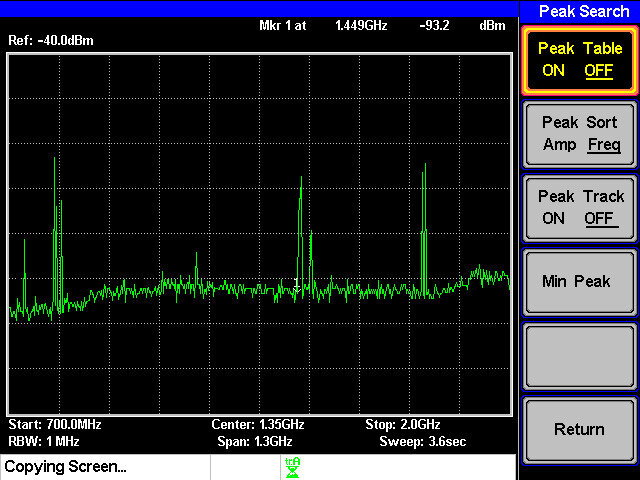
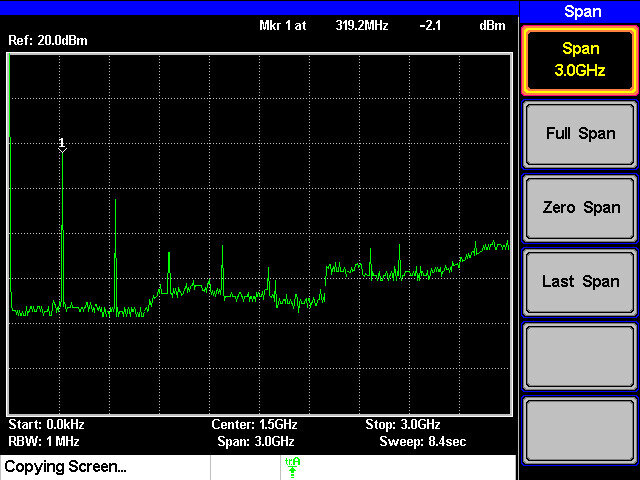
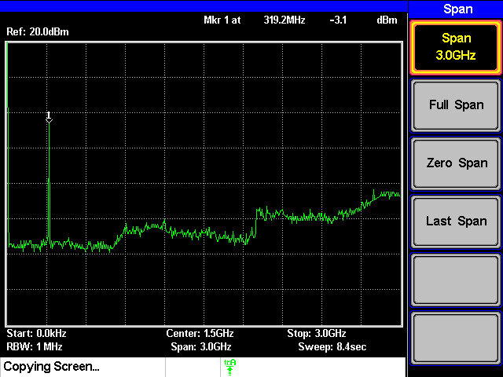
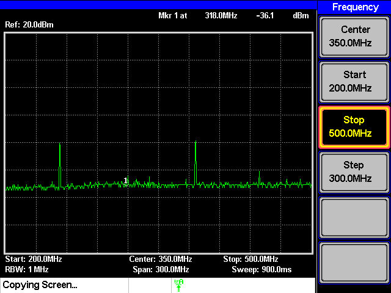
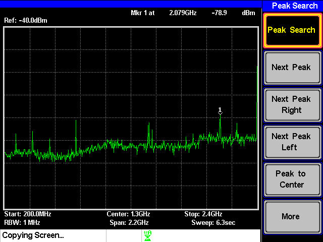

# AM変調
**3I24 中川 寛之**

## 目的
AM変調の送受信実験を通じて、高周波機器および計測器の取り扱いについて学ぶ。

## 共同実験者
- **3I04** 市川 敬士
- **3I14** 公文 健太
- **3I34** 藤原 魁

---

## 課題

### 1. 各自が使用している携帯電話の使用周波数を、スペクトラム・アナライザを用いて確認せよ

**結果**
- 周波数は **1.449[GHz]** だった。

**画像**

**考察**  

今回の測定結果から、使用している携帯電話が **1.5GHz帯** を利用していることがわかった。

[参考](https://www.au.com/content/dam/au-com/mobile/product/smartphone/fcg01/pdf/fcg01_syuuhasu.pdf)  

---

### 2. 信号発生器(XCO0320)の出力波形の周波数スペクトルおよび、それにバンドパスフィルタ(BPF0320)を付けた場合の出力を、スペアナで観測する

**結果**
- 以下の画像のようになった

**信号発生器の出力波形**

**バンドパスフィルタをつけた場合**

**考察**
信号発生器の出力には、目的とする周波数成分だけでなく、ノイズや不要な成分も含まれています。そのため、バンドパスフィルタを通すことで特定の周波数帯のみを抽出し、雑音を取り除くことができました。これは、無線通信やオーディオ機器においても一般的に行われている処理であり、不要な干渉を防ぐために欠かせない技術です。

---

### 3. 一段目のミキサ(MIX0400u)までを組み立て、その出力の周波数スペクトルをスペアナで観測せよ

**結果**
- 以下の画像のようになった

**考察**
バンドパスフィルタを通した周波数 fB[Hz] と、ローパスフィルタを通した周波数 fL[Hz] を合わせるのが、
ミキサである。
  - **f1 = fB + fL**
  - **f2 = fB − fL**  
より、各々の周波数が画像に表⽰されることが確認できた。

---

### 4. 送信側のモジュールを完成させ、スペアナでアンテナからの送信波の周波数スペクトルを確認せよ

**結果**
- 周波数は **2.079[GHz]** だった。

**画像**

**考察**
アンテナの長さは波長の **1/4** の長さなので、。今回の実験では、送信周波数が **2.079GHz** であり、その波長を求めると以下のようば式になる。
$$
  \lambda = \frac{3.0 \times 10^8}{2.079 \times 10^9} \approx 0.144 \text{m} = 14.4 \text{cm}
$$
この **1/4** の長さは約 **3.6cm** となり、実験に使用したアンテナのサイズと近い。なので、設計されたアンテナが適切な長さであることが確認できた。

---

### 5. AM変調の送受信実験を行う

**結果**
- かなりきれいに音声を確認することができた。
- ただ、高音では音が出ないような時もあり、周波数が高く遮蔽物に弱いので、音が聞こえづらい部分があった。